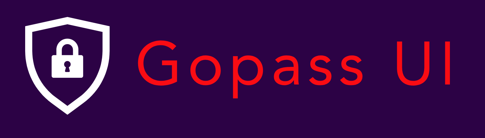
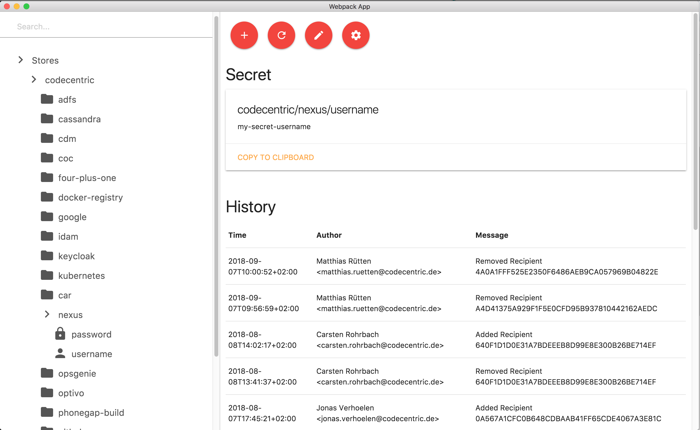

# Gopass UI

## What is Gopass and Gopass UI?

> [Gopass](https://github.com/gopasspw/gopass) is a rewrite of the pass password manager in Go with the aim of making it cross-platform and adding additional features – (Taken from Github)

The repository you're currently looking at contains `Gopass UI`, an Electron based UI wrapper for your `gopass` on the command line. It makes your life easier by providing a rich graphical user interface to search and manage your secrets. It looks like this:

In addition there is a globally usable search window that can be opened with `cmd+shift+p`.

## How can I use it?

Just [download](https://github.com/codecentric/gopass-ui/releases) the packaged application from this repository and install it according to your operating system. 
Of course, you need to have [Gopass](https://github.com/gopasspw/gopass) up and running already.

## Issues

Please report any issues and problems to us. We are very keen about your feedback and appreciate any help.

## Contribution

You'd like to help us? No problem. See how to [get started with development](docs/development.md). We are looking forward to your pull requests and issues. 

|  |  |
:---: | :---:
|[Jonas Verhoelen](https://github.com/jverhoelen) | [Matthias Rütten](https://github.com/ruettenm)|

## License
MIT
